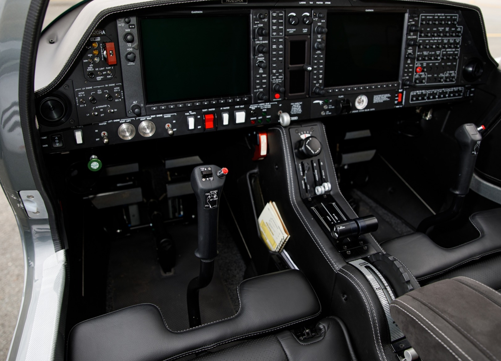

# Avionics Hardware Stack for the [Flight Factor](https://www.flightfactor.aero/) Airbus A350 XWB Advanced v1.7+ (Latest Patch)
---

> [!NOTE]
> I've attached the first ALPHA version of the EFIS-CP hardware module. While this is not the final design, I just wanted to display the current progress. 

---

 

---

 

---

 

---

> [!NOTE]
> The project repository is a place holder while the first module is under development.
> Files will be released when they're ready.

## Overview

While this is a ongoing project, I do this all in my own time as I have other commitments (Young Family, Full time Job, Other projects). Please bear with me while this builds into something more complete. I will be releasing module by module, as and when, they're finished and tested 👨‍🚀

The following modules are being actively designed and worked on:

- [ ] EFIS-CP Captains Side - "In Dev"
- [ ] X-Plane 11 / 12 Plugin - "In Dev"
- [ ] Dedicated WASM Module using the opensource FlightSimConnector
- Overhead Modules and other cockpit parts to follow.

---
> [!NOTE]
> Looking for Professional Engineered Cockpit Components & Avionics? Check out DezAer [@DezAer](https://www.facebook.com/REALISMcockpitsimulation/)

 

 

 

---

## Getting Started
---
- X-Plane 11 / 12 
- KiCad 8 + (I'm on Version 9)
- FreeCad 1.0.0 upwards
- Visual Studio Code with STM32-CMAKE (Or your own IDE Preference) This might change with the new RP2350B 
- PFD Viewer / [Gerber Viewer](https://jlcpcb.com/RGE)

<br>
<br>
## Future Development
---

```
More to come later on this......
```

## Acknowledgments
---
- DezAero (CockpitParts.com)
- To all of the Flight Simulation community for the last 20 + years. It's amazing to see the community grow to what it is now!
- To all the awesome people I've had the pleasure of meeting and designing projects together with in the past.
- 3D Modeller from FBW Simulations for measurements and Dennis Vijverbergs from Brakes [Brakes Released](https://www.youtube.com/@dennisvijverbergbrakesrele6098/featured)

## Contact
---
- [Project Link](https://github.com/Pwoodlock/Airbus-A350X-A380X)
- Email: patrick@devsec.ie

## Project Status
---
This project is currently in active development. Please check the [Issues](https://github.com/Pwoodlock/Airbus-A350X-A380X/issues) page for current tasks and project status.

## License

Creative Commons Attribution-NonCommercial 4.0 International License - see the [LICENCE.md](LICENCE.md) file for details.

---
